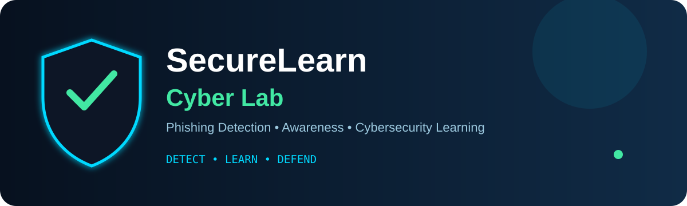

<div align="center">



[](https://www.python.org/)
[](https://flask.palletsprojects.com/)
[](https://scikit-learn.org/)
[](https://github.com/wwwsahilchand123-maker/SecureLearn-Cyber-Lab)

### 🛡️ Detect • Learn • Defend

**An interactive phishing-detection and cybersecurity-awareness simulator built for practical learning.**

</div>

---

## 🎯 What is SecureLearn?

SecureLearn Cyber Lab is an educational B.Tech Cyber Security project that helps users understand phishing attacks, suspicious URLs, malicious emails and social-engineering techniques through an interactive web-based simulator.

## ✨ Highlights

| Capability | Purpose |
|---|---|
| 🔗 Phishing URL Analysis | Analyze suspicious links and identify phishing indicators |
| 📧 Email Analysis | Study potentially malicious email patterns |
| 🤖 ML Prediction | Machine-learning based phishing classification |
| 🎓 Awareness Simulator | Learn through controlled phishing scenarios |
| 📝 Security Quiz | Test cybersecurity awareness |
| 📊 Dashboard | View analysis and learning information |
| 🗄️ Local Database | Store application data locally |

## ⚡ How It Works

```text
User Input
    ↓
URL / Email / Scenario Analysis
    ↓
Feature Extraction + ML
    ↓
Prediction / Risk Insight
    ↓
Awareness + Learning Feedback
```

## 🧰 Tech Stack

**Frontend:** HTML5 • CSS3 • JavaScript  
**Backend:** Python • Flask  
**ML:** Scikit-learn • Random Forest  
**Database:** SQLite

## 📁 Project Structure

```text
SecureLearn-Cyber-Lab/
├── backend/
│   ├── routes/
│   ├── services/
│   ├── database/
│   ├── models/
│   ├── app.py
│   └── config.py
├── frontend/
│   ├── css/
│   ├── js/
│   ├── index.html
│   ├── dashboard.html
│   ├── quiz.html
│   └── simulator.html
├── ml/
│   ├── dataset/
│   ├── model/
│   ├── predict.py
│   └── train_model.py
├── requirements.txt
├── run_server.py
└── run_project.bat
```

## 🚀 Quick Start

```bash
git clone https://github.com/wwwsahilchand123-maker/SecureLearn-Cyber-Lab.git
cd SecureLearn-Cyber-Lab
pip install -r requirements.txt
python run_server.py
```

> Use this project for authorized learning, awareness and lab environments only.

## 🔮 Future Scope

- More phishing datasets and scenarios
- Advanced ML evaluation
- Interactive attack visualizations
- Expanded security-awareness modules
- More detailed analytics and reporting

---

<div align="center">

### 🛡️ Learn the threat. Recognize the signal. Defend smarter.

**Built by Sahil Chand**

</div>
