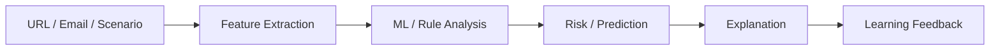

<div align="center">


[](https://www.python.org/)
[](https://flask.palletsprojects.com/)
[](https://scikit-learn.org/)
[](https://github.com/wwwsahilchand123-maker/SecureLearn-Cyber-Lab)

### 🛡️ Detect • Learn • Defend

**An interactive phishing-analysis and cybersecurity-awareness lab built for practical learning.**

</div>

---

## 🎯 Why SecureLearn?

SecureLearn Cyber Lab turns common phishing and social-engineering concepts into an interactive learning experience. Users can analyze suspicious URLs and emails, explore controlled scenarios and test their security awareness.

## ✨ Lab Modules

| Module | What it demonstrates |
|---|---|
| 🔗 URL Analysis | Extracts indicators from suspicious links |
| 📧 Email Analysis | Examines potentially malicious email patterns |
| 🤖 ML Classification | Demonstrates machine-learning based phishing prediction |
| 🎓 Awareness Simulator | Controlled social-engineering scenarios |
| 📝 Security Quiz | Measures cybersecurity awareness |
| 📊 Dashboard | Presents analysis and learning information |

## ⚡ Data Flow



## 🧰 Tech Stack

**Frontend:** HTML5 • CSS3 • JavaScript  
**Backend:** Python • Flask  
**ML:** Scikit-learn • Random Forest  
**Database:** SQLite

## 📁 Project Structure

```text
SecureLearn-Cyber-Lab/
├── backend/
│   ├── routes/
│   ├── services/
│   ├── database/
│   ├── models/
│   ├── app.py
│   └── config.py
├── frontend/
│   ├── css/
│   ├── js/
│   ├── index.html
│   ├── dashboard.html
│   ├── quiz.html
│   └── simulator.html
├── ml/
│   ├── dataset/
│   ├── model/
│   ├── predict.py
│   └── train_model.py
├── requirements.txt
├── run_server.py
└── run_project.bat
```

## 🚀 Quick Start

```bash
git clone https://github.com/wwwsahilchand123-maker/SecureLearn-Cyber-Lab.git
cd SecureLearn-Cyber-Lab
pip install -r requirements.txt
python run_server.py
```

## 🧪 What to Demonstrate

1. Submit a URL for analysis.
2. Inspect the extracted indicators and prediction.
3. Try the awareness simulator.
4. Complete the security quiz.
5. Review the dashboard.

## 🔬 ML Note

The ML component is a learning-oriented classifier. **Model quality should not be represented by accuracy alone.** A serious evaluation should use a representative dataset and report precision, recall, F1-score, confusion matrix and false-positive behaviour.

## 🔮 Roadmap

- [ ] Expand and document representative phishing datasets
- [ ] Add reproducible model evaluation
- [ ] Add confusion-matrix and metric visualizations
- [ ] Expand controlled awareness scenarios
- [ ] Add richer analytics and reporting

## ⚠️ Disclaimer

This project is for academic, awareness and authorized lab use. A prediction from this application is an indicator, not proof that a URL or email is malicious.

---

<div align="center">

### 🛡️ Learn the threat. Recognize the signal. Defend smarter.

**Built by Sahil Chand**

</div>
